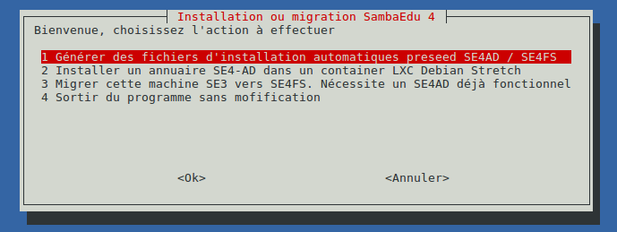

===============
sambaedu-config
===============

Paquet contenant les scripts de configuration pour migration d'un serveur ``Se3`` vers un serveur ``Se4``.

**Ce Dépôt est destiné à la version Wheezy à installer sur un se3. Un paquet du même nom existe en outre en Stretch pour les serveurs SE4**

.. sectnum::
.. contents:: Table des matières

Objectifs
=========

Le paquet ``sambaedu-config`` a pour but la mise à disposition des éléments nécessaires à la migration de SE3 vers les serveurs SE4-FS et SE4-AD ``(Active Directory)``.

Principe de fonctionnement
==========================

SambaEdu 4 repose désormais sur l'utilisation de deux entités : SE4-FS (Files System) et SE4-AD (Active Directory) hébergeant surtout les fonctions d'annuaire. 
En ce qui concerne le ``Se4-AD``, deux possibilités de fonctionnement (exclusives l'une de l'autre) sont proposées :

* Un container de type ``LXC`` qui n'est autre que de la virtualisation très allégée, à privilégier pour un serveur ne disposant que de peu de mémoire qui en outre ferait fonctionner le SE4-FS.  
* Une machine virtuelle indépendante type ``Proxmox``, ``Xen``, ``Vmware ESX``, ou autre. Dans ce cas, on pourra générer automatiquement un fichier ``preseed`` permettant ensuite l'installation et la configuration automatique du ``Se4-AD`` comme pour le ``SE4-FS``. 

**Important** : Dans tous les cas, l'ensemble des éléments de l'annuaire ``LDAP`` d'origine sont récupérés de façon à être injectés lors de la phase de configuration de l'``Active Directory`` et toute l'installation est automatisée.

Installation du paquet ``sambaedu-config``
==========================================

Le paquet ``sambaedu-config`` est installable via les commandes habituelles à condition de `déclarer le dépôt testing sur le serveur Se3. <https://github.com/SambaEdu/se3-docs/blob/master/dev-clients-linux/upgrade-via-se3testing.md#installer-et-tester-en-toute-sécurité-la-version-dun-paquet-issue-de-la-branche-se3testing>`__

Une fois le dépôt ``testing`` activé, il reste ensuite à installer le paquet : ``apt-get install sambaedu-config``.

Le paquet ``sambaedu-config`` déposera les fichiers de configuration nécessaires ainsi que les différents scripts dont le script principal ``sambaedu-config.sh``.

Lancement du menu de configuration et d'installation
====================================================

Il suffit de lancer la commande ``sambaedu-config.sh`` afin d'afficher le menu :

Les différentes options d'installation sont détaillées dans le paquet `SambaEdu4. <https://github.com/SambaEdu/se4#a-partir-d-un-se3-existant>`__

Roadmap - feuille de route du projet
====================================

Voir l'état d'avancement du paquet sambaedu-config dans la `partie dédiée de Github <https://github.com/orgs/SambaEdu/projects/6>`__

